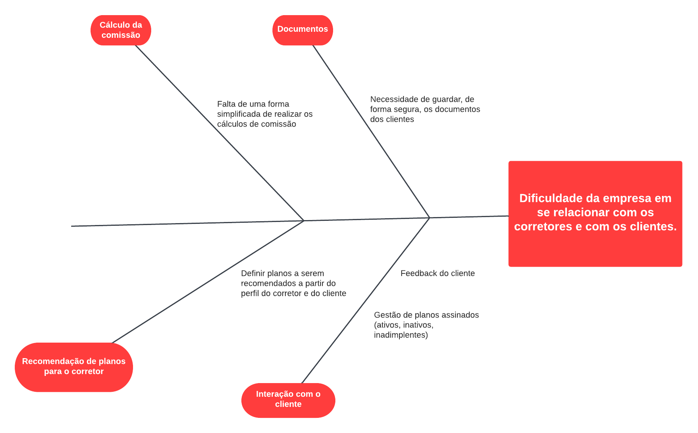

# Visão Geral do Produto

## Problema

 Com base na experiência de um corretor de seguros, um dos principais problemas enfrentados hoje é a própria gestão da sua empresa. Mesmo com o uso de serviços pagos de gestão, ainda fica aparente a falta de uma plataforma que seja focada no usuário e que tenha alguns serviços que hoje são feitos em planilhas, muito propensos a erros humanos. Buscando uma forma de reduzir esses erros e também automatizar tarefas que hoje consomem muito tempo, entendemos que um software que faça esses serviços é bastante desejado nesse nicho de negócio, podendo ser cada vez mais abrangente e futuramente ser uma plataforma completa de gestão de corretoras, seguradoras, e empresas de todos os nichos e com os mesmos problemas que encontramos agora.

## Declaração de Posição do Produto

|||
|------|-----------------------------------|
| Para | Gestores de corretoras de seguros |
| Quem | Necessita de um sistema centralizado para gerir a corretora |
| O Nimbus | É uma aplicação web |
| Que | Auxilia na gestão da corretora e na interação desta com os clientes |
| Ao contrário | Agendor |
| Nosso produto | Além de fornecer ferramentas que promovem a relação cliente-corretora, provê funcionalidades que auxiliam na gestão da corretora como um todo, como o controle das comissões e proteção de documentos de clientes |

## Objetivos do Produto

#### Objetivos Principais:

1. Prover uma forma simplificada de calcular a comissão de cada venda para os corretores  
2. Prover uma forma de guardar os dados de documentos sensíveis dos clientes;

#### Objetivos Secundários

1. Fomentar a interação da corretora com seus clientes e angariar dados deles para a tomada de decisões da corretora.

## Tecnologias a serem utilizadas

- Front-end: typescript + react
- Back-end: java + springboot + postgres
